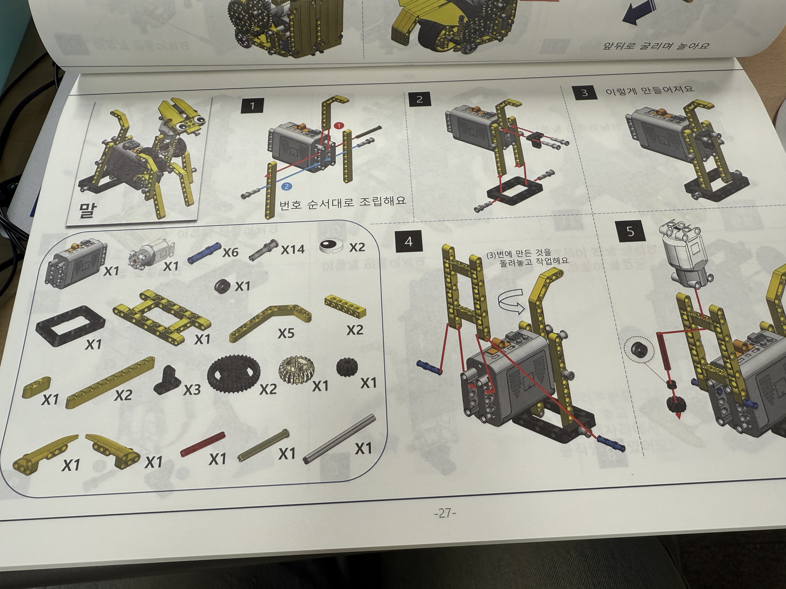

# hello-world
IT 테스터과정입니다.
# 홍길동의 github 홈페이지
## IT 어린이입니다.
 파이썬 프로그래밍 프로젝트입니다. 
## 전체 설계도
 
[발표자료](/도서대여서비스 발표내용 정리_20240630.docx) 
## 발표 동영상
발표 동영상입니다.
<iframe id="ytplayer" type="text/html" width="640" height="360“ src="https://www.youtube.com/embed/jsRqtnGOavk" frameborder="0"></iframe>
## Reference
[검색엔진](https://naver.com)
[Repository 1](https://{github-id}.github.io/{repository-name}) 

